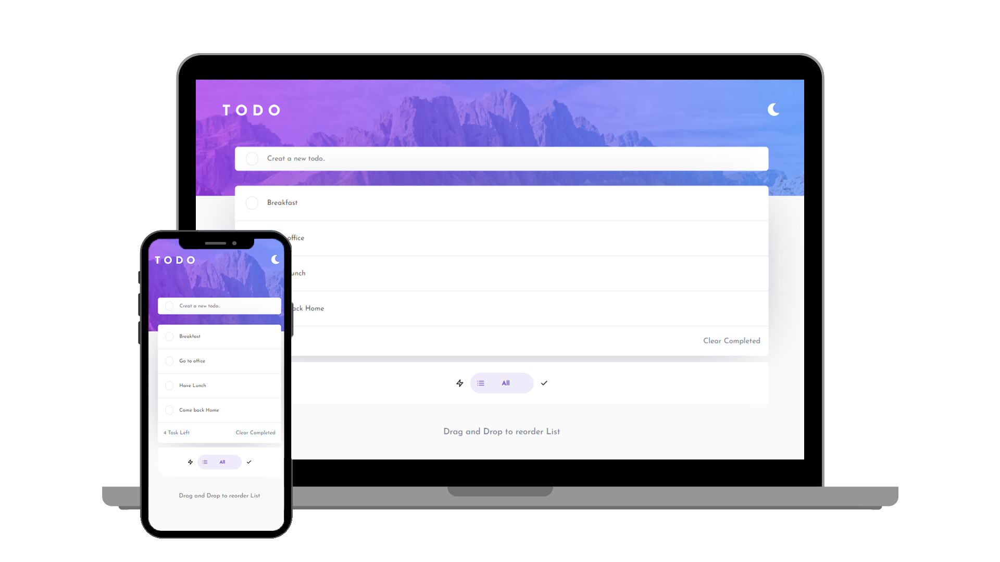

# TODO List

## Welcome! 👋

> This Website Allows you to creat your game and add your players score.



                              
## Built With ✔️

- HTML 😄
- SASS 🔥
- JavaScript ES6 😋
- WebPack 😉

## Functionalites 😄

- Can Add New task. 😄
- Can edit Task by hovering on the field. 😋
- Can Delete Task by hovering on the field. 🙌
- Can clear completed Task.🥳
- Can switch between dark and light mode. 🌑
- Bottom NavBar can be used to filter the tasks. 😉
- Accessibility options are used. 🔥🔥
- User can resort the list by using drag and drop functionality. 🔥🥳🥳

    

## Live Demo ✔️

[Live Demo](https://developerwaleed.github.io/Interactive-TODOLIST/)


## Getting Started 🙌

To get a local copy up and running follow these simple example steps.

### Prerequisites
```
  node js
  npm

```
### Setup
Clone the repository and change the directory to portfolio

``` 
  `$ git clone 'https://github.com/caasperr/Interactive-TODOLIST.git'`

  `$ cd Interactive-TODOLIST.git`

```

### Install
Install all project dependencies by running the command below
 
``` 
 ` $ npm install`
```
### Usage

Run
``` 
  `$ start local server
```

### Deployment
- [Visit Application Homepage](http://localhost:8080)


### Authors

| 👤 Name | Github | Twitter | LinkedIn |
|------|--------|---------|----------|
|Waleed Amjad|[@caasperr](https://github.com/caasperr)|[@developerwaleed](https://twitter.com/developerwaleed)|[@Waleed Amjad](https://www.linkedin.com/in/waleed-amjad-51930014a/)|


## 🤝 Contributing

Contributions, issues, and feature requests are welcome!


## Show your support

Give a ⭐️ if you like this project!

## Acknowledgments

- Hat tip to [Frontend Mentor](https://www.frontendmentor.io/) for giving me this project to work on


## 📝 License

This project is licensed to Waleed.

## Authors

👤 **Waleed Amjad**

| 👤 Name | Github | Twitter | LinkedIn |
|------|--------|---------|----------|
|Waleed Amjad|[@caasper](https://github.com/caasperr)|[@developerwaleed](https://twitter.com/developerwaleed)|[Waleed Amjad](https://www.linkedin.com/in/waleed-amjad-51930014a/)||


## Acknowledgments

- Hat tip to MicroVerse for the Template and Task.

## Show your support

Give a ⭐️ if you like this project!


## 📝 License

All rights reserved.
